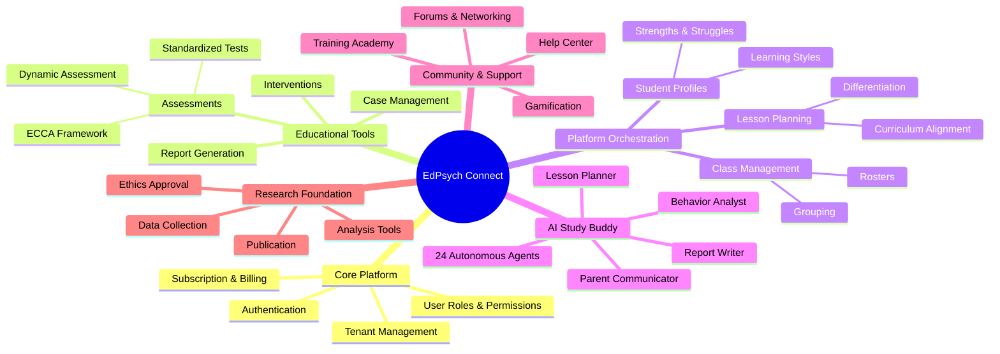
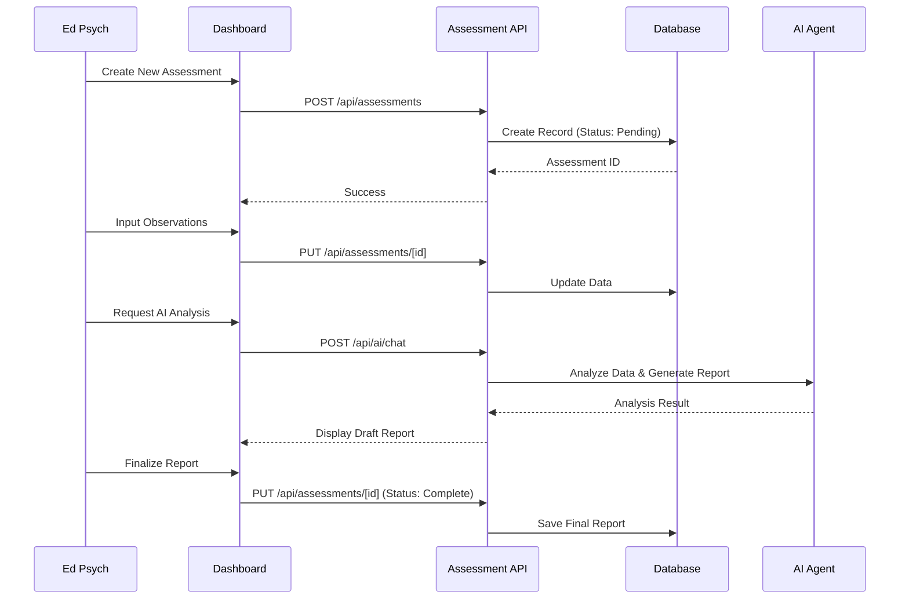
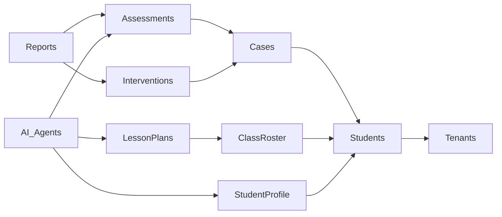

# Platform Architecture & Feature Map

This document provides a graphical representation of the EdPsych Connect platform features, their organization, and data flow.

## High-Level Architecture

```mermaid
graph TD
    User[User / Professional] --> Frontend[Next.js Frontend]
    Frontend --> API[Next.js API Routes]
    API --> Auth[Auth Service]
    API --> Prisma[Prisma ORM]
    API --> AI[AI Integration Service]
    
    Prisma --> DB[(PostgreSQL Database)]
    AI --> OpenAI[OpenAI API]
    AI --> Claude[Anthropic API]
    AI --> Redis[Upstash Redis Cache]
    
    subgraph "Core Modules"
        Auth
        Tenant[Tenant Management]
        UserMgmt[User Management]
    end
    
    subgraph "Educational Modules"
        Assessments[Assessment System]
        Cases[Case Management]
        Interventions[Intervention Tracking]
        Reports[Report Generation]
    end
    
    subgraph "Platform Orchestration"
        Orchestrator[Orchestration Layer]
        StudentProfile[Student Profiles]
        LessonPlans[Lesson Planning]
        ClassRoster[Class Rosters]
    end
    
    subgraph "AI Agents (Study Buddy)"
        ReportWriter[Report Writer]
        LessonPlanner[Lesson Planner]
        BehaviorAnalyst[Behavior Analyst]
        ParentComm[Parent Communicator]
        AssessmentEval[Assessment Evaluator]
    end
    
    API --> Tenant
    API --> UserMgmt
    API --> Assessments
    API --> Cases
    API --> Interventions
    API --> Orchestrator
    
    Orchestrator --> StudentProfile
    Orchestrator --> LessonPlans
    Orchestrator --> ClassRoster
    
    AI --> ReportWriter
    AI --> LessonPlanner
    AI --> BehaviorAnalyst
    AI --> ParentComm
    AI --> AssessmentEval
```

## Feature Organization

## Data Flow: Assessment Process

## Module Dependencies

